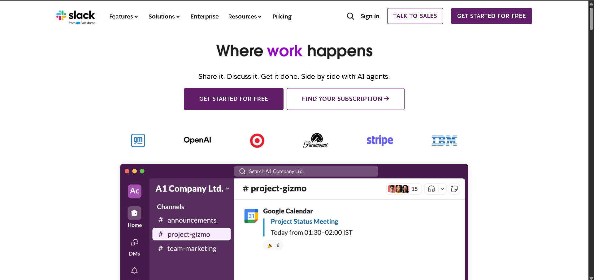

# 🚀 Slack Landing Page Design

A modern, responsive, and pixel-perfect **Slack Landing Page** clone built using **React + Vite**, styled with **Styled Components/TailwindCSS** (as per your setup), and enhanced with smooth animations.

🔗 **Live Demo:** [View on GitHub Pages](https://a2rp.github.io/slack-landing-page-design/)  
📦 **Repository:** [GitHub Repo](https://github.com/a2rp/slack-landing-page-design)

---

## 📸 Screenshots



---

## ✨ Features

-   🎯 Pixel-perfect Slack landing page clone
-   📱 Fully responsive for all devices
-   🎨 Modern UI/UX with consistent design system
-   ⚡ Built with **Vite** for lightning-fast builds
-   🖌️ Styled using **Styled-Components**
-   🔄 Smooth animations with **aos**

---

## 🛠️ Tech Stack

-   **Frontend:** React (Vite)
-   **Styling:** Styled Components
-   **Animations:** aos
-   **Deployment:** GitHub Pages

---

---

## ⚙️ Setup & Installation

1. **Clone the repo**

```bash
git clone https://github.com/a2rp/slack-landing-page-design.git
cd slack-landing-page-design
```

Install dependencies

```bash
npm install
```

Run the project locally

```bash
npm run dev
```

📌 Learnings
Practiced responsive design and mobile-first approach
Improved understanding of animations and transitions in modern UIs

💡 If you like this project, don’t forget to ⭐ the repo!
