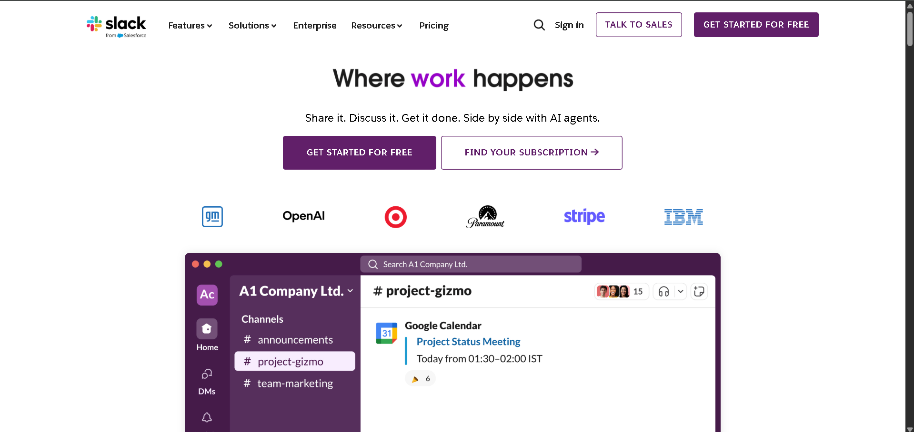

# 🚀 Slack Landing Page Design

A modern, responsive, and pixel-perfect **Slack Landing Page** clone built using **React + Vite**, styled with **Styled Components/TailwindCSS** (as per your setup), and enhanced with smooth animations.

🔗 <a href="https://a2rp.github.io/slack-landing-page-design/" target="_blank">**Live Demo**</a>

---

## 📸 Screenshots



---

## ✨ Features

-   🎯 Pixel-perfect Slack landing page clone
-   📱 Fully responsive for all devices
-   🎨 Modern UI/UX with consistent design system
-   ⚡ Built with **Vite** for lightning-fast builds
-   🖌️ Styled using **Styled-Components**
-   🔄 Smooth animations with **aos**

---

## 🛠️ Tech Stack

-   **Frontend:** React (Vite)
-   **Styling:** Styled Components
-   **Animations:** aos
-   **Deployment:** GitHub Pages

---

## ⚙️ Setup & Installation

**Clone the repo**

```bash
git clone https://github.com/a2rp/slack-landing-page-design.git
cd slack-landing-page-design
```

Install dependencies

```bash
npm install
```

Run the project locally

```bash
npm run dev
```

📌 Learnings: Practiced responsive design and mobile-first approach.
Improved understanding of animations and transitions in modern UIs

💡 If you like this project, don’t forget to ⭐ the repo!

## Links

- Portfolio: [https://www.ashishranjan.net](https://www.ashishranjan.net)
- GitHub: [https://github.com/a2rp](https://github.com/a2rp)
- CodePen: [https://codepen.io/ash1198](https://codepen.io/ash1198)
- LinkedIn: [https://www.linkedin.com/in/aashishranjan](https://www.linkedin.com/in/aashishranjan)
- Facebook: [https://www.facebook.com/theash.ashish/](https://www.facebook.com/theash.ashish/)
- YouTube: [https://www.youtube.com/@ashishranjan-ashz?sub_confirmation=1](https://www.youtube.com/@ashishranjan-ashz?sub_confirmation=1)
- Email: [ash.ranjan09@gmail.com](mailto:ash.ranjan09@gmail.com)

## Support

- Support: [https://a2rp-donation-page.netlify.app/](https://a2rp-donation-page.netlify.app/)
- Buy Me A Coffee: [https://buymeacoffee.com/a2rp](https://buymeacoffee.com/a2rp)
- Patreon: [https://patreon.com/a2rp](https://patreon.com/a2rp)
<!-- Project links -->

## Links

- Live: [https://a2rp.github.io/slack-landing-page-design/](https://a2rp.github.io/slack-landing-page-design/)
- Repository: [https://github.com/a2rp/slack-landing-page-design](https://github.com/a2rp/slack-landing-page-design)
- Portfolio: [https://www.ashishranjan.net/](https://www.ashishranjan.net/)
- GitHub: [https://github.com/a2rp](https://github.com/a2rp)
- CodePen: [https://codepen.io/ash1198](https://codepen.io/ash1198)
- LinkedIn: [https://www.linkedin.com/in/aashishranjan](https://www.linkedin.com/in/aashishranjan)
- Facebook: [https://www.facebook.com/theash.ashish/](https://www.facebook.com/theash.ashish/)
- YouTube: [https://www.youtube.com/@ashishranjan-ashz?sub_confirmation=1](https://www.youtube.com/@ashishranjan-ashz?sub_confirmation=1)
- Email: [ash.ranjan09@gmail.com](mailto:ash.ranjan09@gmail.com)

## Support

- Support: [https://a2rp-donation-page.netlify.app/](https://a2rp-donation-page.netlify.app/)
- Buy Me a Coffee: [https://buymeacoffee.com/a2rp](https://buymeacoffee.com/a2rp)
- Patreon: [https://www.patreon.com/a2rp](https://www.patreon.com/a2rp)
