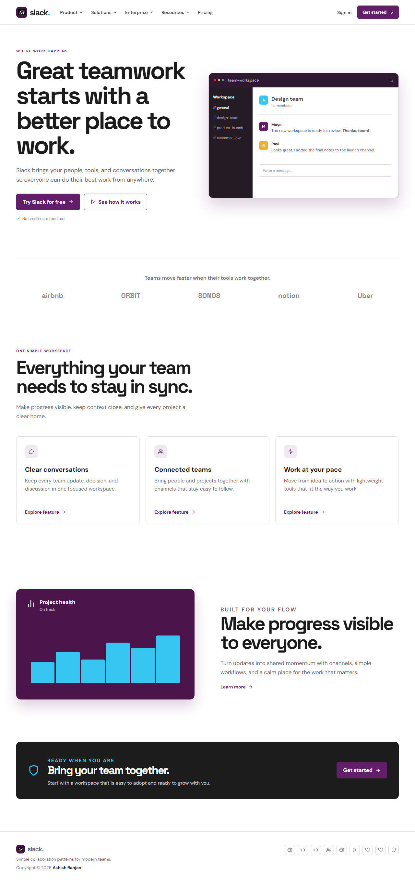

# Slack Landing Page Design

A responsive React and Vite landing page inspired by modern collaboration products. It presents a workspace preview, feature sections, a responsive navigation menu, and a clear sign-up call to action.



## Features

- Responsive fixed header with mobile menu
- Workspace preview, trust strip, feature cards, progress section, and CTA
- Local logo and hero assets
- React Icons for interface actions and footer links
- Floating go-to-top control and dynamic copyright year

## Tech stack

- React and Vite
- CSS
- React Icons

## Run locally

```bash
npm install
npm run dev
```

## Deployment

Live app: [https://a2rp.github.io/slack-landing-page-design/](https://a2rp.github.io/slack-landing-page-design/)

## Links

- Portfolio: [https://www.ashishranjan.net/](https://www.ashishranjan.net/)
- GitHub: [https://github.com/a2rp](https://github.com/a2rp)
- CodePen: [https://codepen.io/ash1198](https://codepen.io/ash1198)
- LinkedIn: [https://www.linkedin.com/in/aashishranjan](https://www.linkedin.com/in/aashishranjan)
- Facebook: [https://www.facebook.com/theash.ashish/](https://www.facebook.com/theash.ashish/)
- YouTube: [https://www.youtube.com/@ashishranjan-ashz?sub_confirmation=1](https://www.youtube.com/@ashishranjan-ashz?sub_confirmation=1)
- Email: [ash.ranjan09@gmail.com](mailto:ash.ranjan09@gmail.com)

## Support

- Support: [https://a2rp-donation-page.netlify.app/](https://a2rp-donation-page.netlify.app/)
- Buy Me a Coffee: [https://buymeacoffee.com/a2rp](https://buymeacoffee.com/a2rp)
- Patreon: [https://patreon.com/a2rp](https://patreon.com/a2rp)